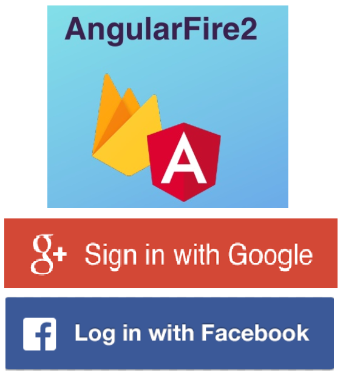

#Login by Google and Facebook with angularfire2 Build to angular 5



##Demo
[CLick to Demo]()

## Getting Started

Clone project and running test in local  
```
http://localhost:4200
```

### Prerequisites

You need to install the software.

- Angular version 5 or greater

Install global angular cli

```
npm install -g @angular/cli@latest

// If error install

npm i -g npm
npm cache verify
npm cache clean --force

// Already again

npm install -g @angular/cli@latest

```

## Running 

```
http://localhost:4200
```

## Authors

* **Panusitt Khuenkham** - *Developer*


## License
Open source licenses